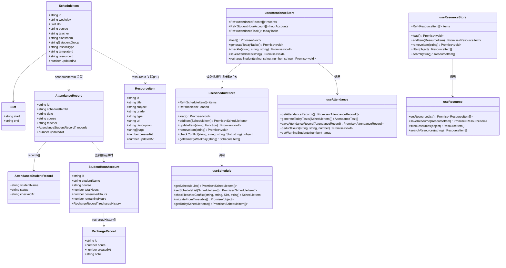
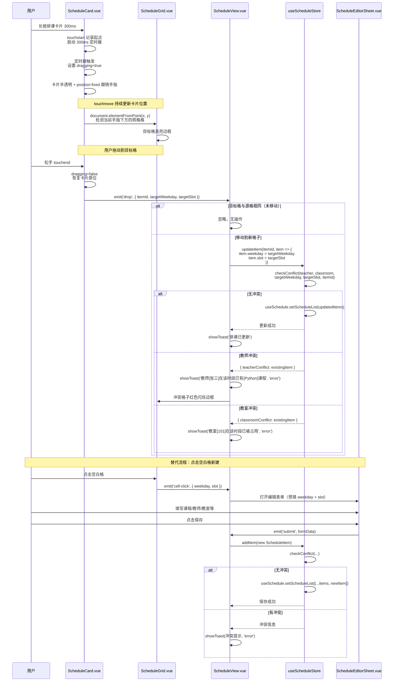
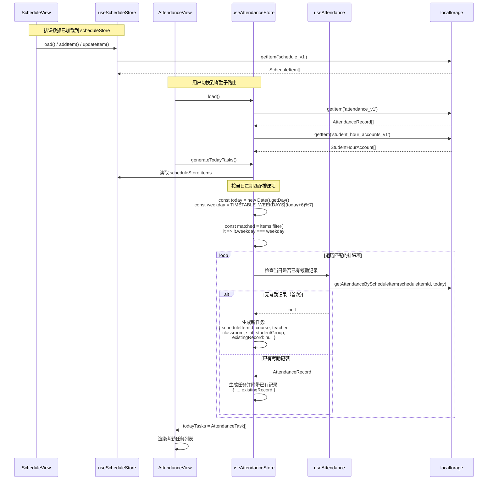
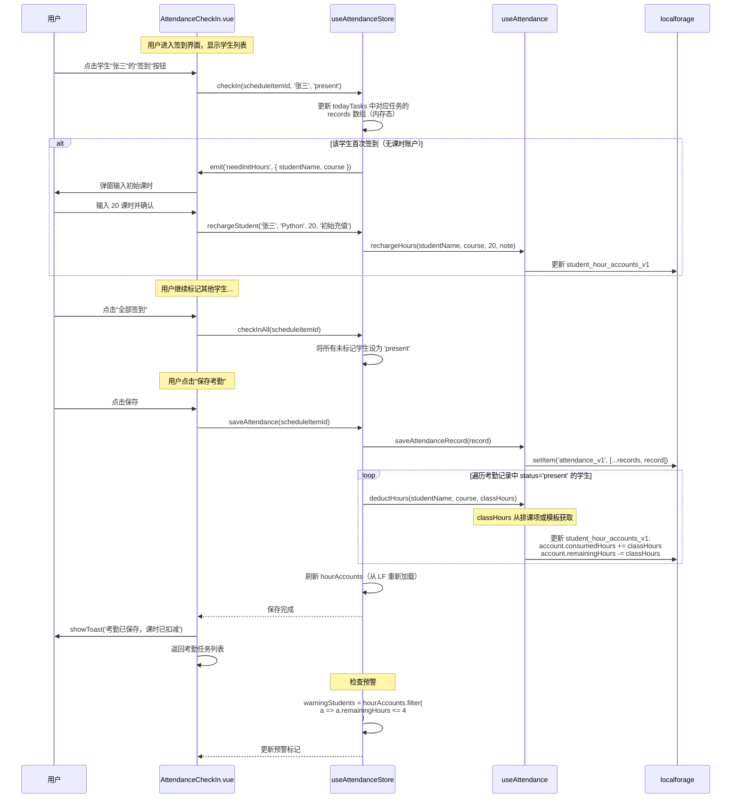
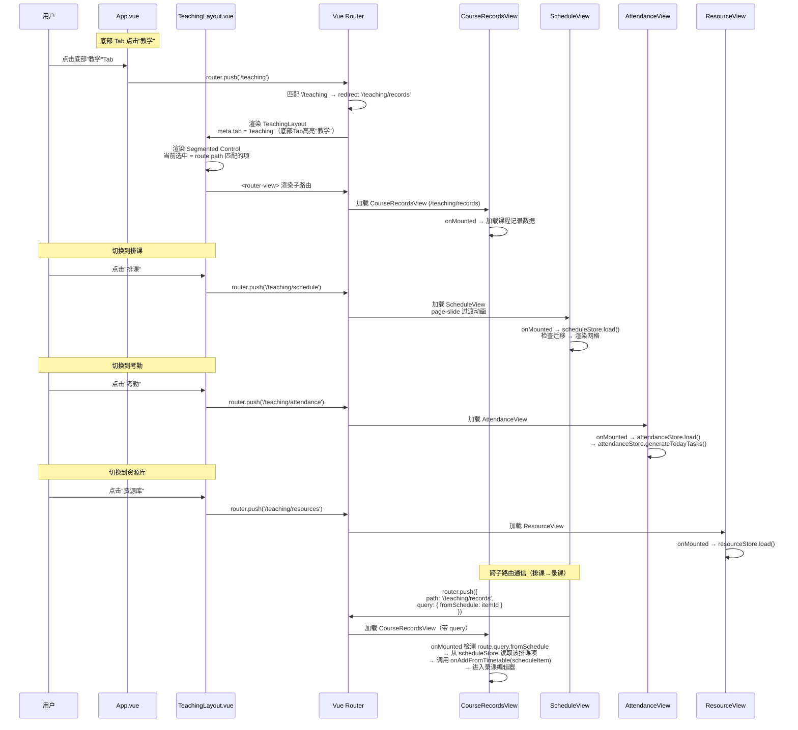
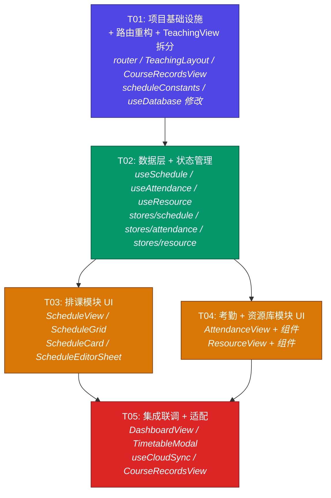

# 系统架构设计：智能排课表 + 考勤课时统计 + 教案课件资源库

> 架构师：高见远（Gao）  
> 基于产品经理 Alice 的 PRD 文档 `docs/PRD-teaching-mgmt.md` 编写  
> 项目路径：`F:\项目\my-course-record-h5`

---

## 目录

- [Part A: 系统设计](#part-a-系统设计)
  - [1. 实现方案 + 框架选型](#1-实现方案--框架选型)
  - [2. 完整文件列表](#2-完整文件列表)
  - [3. 数据结构和接口](#3-数据结构和接口)
  - [4. 程序调用流程](#4-程序调用流程)
  - [5. 待明确事项](#5-待明确事项)
- [Part B: 任务分解](#part-b-任务分解)
  - [6. 依赖包列表](#6-依赖包列表)
  - [7. 任务列表](#7-任务列表)
  - [8. 共享知识](#8-共享知识)
  - [9. 任务依赖图](#9-任务依赖图)

---

# Part A: 系统设计

## 1. 实现方案 + 框架选型

### 1.1 技术栈确认

沿用现有技术栈，**不引入新的核心框架依赖**：

| 层面 | 技术 | 说明 |
|------|------|------|
| 框架 | Vue 3.5 (Composition API) | `<script setup>` 语法 |
| 构建 | Vite 5 | 现有配置不变 |
| 样式 | TailwindCSS 3 (darkMode: 'class') | 新组件严格适配暗色模式 |
| 路由 | Vue Router 4 | **重构为嵌套子路由** |
| 状态 | Pinia 2 | 新增 3 个 store |
| 持久化 | localforage (IndexedDB) | 新增 4 个存储 key |
| 图表 | Chart.js 4 | 考勤看板 P1 复用 |
| PWA | vite-plugin-pwa | 不变 |

### 1.2 新增依赖包

**P0 阶段无需新增任何 npm 依赖。** 拖拽排课使用原生 Touch 事件实现（`touchstart`/`touchmove`/`touchend` + 长按 300ms 定时器），不引入第三方拖拽库，原因：

1. 移动端拖拽与桌面端 Drag API 差异大，第三方库（如 vue-draggable、@vueuse/core 的 useDraggable）主要面向桌面鼠标交互
2. PRD 要求"长按 300ms 触发拖拽，卡片半透明跟随手指"——这是自定义触控行为，原生 Touch 事件更直接
3. 减少包体积，保持 PWA 轻量

**P1 阶段可选引入** `@vueuse/core`（提供 `useIntersectionObserver`、`useStorage` 等工具函数，便于虚拟滚动和缓存优化），但非必须。

### 1.3 整体架构思路

#### 核心变更：路由重构 + 布局容器

```
现有结构:
App.vue (底部4Tab) → router-view → TeachingView.vue (1940行巨石组件)

重构后结构:
App.vue (底部4Tab) → router-view → TeachingLayout.vue (Segmented Control + router-view)
                                                        ├── CourseRecordsView.vue  (/teaching/records)
                                                        ├── ScheduleView.vue        (/teaching/schedule)
                                                        ├── AttendanceView.vue      (/teaching/attendance)
                                                        └── ResourceView.vue        (/teaching/resources)
```

#### TeachingView.vue 拆分策略（关键设计决策）

现有 `TeachingView.vue`（1940 行）管理 4 个内部视图（calendar/day/lesson/dashboard）+ 10+ 个弹窗。拆分原则：

1. **CourseRecordsView.vue** = 现有 TeachingView.vue 的**完整逻辑搬迁**（复制粘贴 + 适配调整），承担"课程记录"子模块
2. **TeachingLayout.vue** = 新建布局壳，仅含 Segmented Control 顶部导航 + `<router-view>`
3. **TeachingView.vue** = 删除（路由不再引用此文件）
4. 搬迁时的适配调整：
   - 课表数据源从 `my_timetable` 切换为 `schedule_v1`（通过迁移函数兼容）
   - `onAddFromTimetable` 改为接收 ScheduleItem（含 teacher/classroom/studentGroup 新字段）
   - 去掉外层 `<main>` 包裹（由 TeachingLayout 提供）

#### 三层架构分层

```
┌─────────────────────────────────────────────────────────┐
│                     View 层 (页面)                       │
│  CourseRecordsView  ScheduleView  AttendanceView  ResourceView │
├─────────────────────────────────────────────────────────┤
│                   Component 层 (组件)                     │
│  ScheduleGrid/Card/EditorSheet                          │
│  AttendanceTaskList/CheckIn/Dashboard                    │
│  ResourceList/EditorSheet                               │
├─────────────────────────────────────────────────────────┤
│              Store 层 (Pinia 状态) + Composable 层 (数据) │
│  useScheduleStore    useAttendanceStore    useResourceStore │
│  useSchedule.js      useAttendance.js      useResource.js  │
├─────────────────────────────────────────────────────────┤
│                 Data 层 (localforage/IndexedDB)           │
│  schedule_v1  attendance_v1  student_hour_accounts_v1    │
│  resource_index_v1                                       │
└─────────────────────────────────────────────────────────┘
```

#### 模块间数据流

```
排课模块(schedule_v1) ──按星期匹配──▶ 考勤模块(attendance_v1)
      │                                    │
      │(P1:关联教案)                        │(签到扣减)
      ▼                                    ▼
资源库(resource_index_v1)           课时账户(student_hour_accounts_v1)
```

### 1.4 框架选型与核心挑战分析

| 技术挑战 | 解决方案 |
|---------|---------|
| **移动端拖拽排课** | 原生 Touch 事件 + `position: fixed` 浮动卡片跟随手指 + 300ms 长按定时器 + 目标格命中检测（`document.elementFromPoint`） |
| **教师/教室冲突检测** | 保存前遍历 `schedule_v1` 同 `weekday + slot` 的排课项，检查 teacher/classroom 重复；复杂度 O(n)，50-150 项可接受 |
| **排课→考勤任务生成** | 考勤模块 `onMounted` 时读取 `scheduleStore.items`，按 `new Date().getDay()` 映射到 `TIMETABLE_WEEKDAYS`，过滤当日排课项生成任务 |
| **课时账户按"学生+课程"维度** | 账户唯一键 = `${studentName}__${course}`，使用 Map 索引；签到时查找对应账户扣减 `remainingHours` |
| **旧课表数据迁移** | 首次进入排课模块时检测 `schedule_v1` 为空且 `my_timetable` 有数据，执行迁移：teacher 取 `default_teacher_name_v1`，classroom 留空，studentGroup 留空 |
| **TeachingView 巨石组件拆分** | 整体搬迁到 CourseRecordsView，不做内部重构（降低风险）；后续可逐步拆分 calendar/day/lesson 为独立子组件 |
| **跨子路由通信**（排课→录课） | `router.push({ path: '/teaching/records', query: { fromSchedule: scheduleItemId } })`；CourseRecordsView `onMounted` 检测 query 参数 |

---

## 2. 完整文件列表

### 2.1 新建文件

| # | 相对路径 | 职责 | 所属任务 |
|---|---------|------|---------|
| 1 | `src/layouts/TeachingLayout.vue` | 教学子路由布局容器：顶部 Segmented Control（课程记录/排课/考勤/资源库）+ `<router-view>` + page-slide 过渡 | T01 |
| 2 | `src/views/CourseRecordsView.vue` | 课程记录子模块：从 TeachingView.vue 搬迁全部逻辑（日历/日课/录课/看板 + 所有弹窗） | T01 |
| 3 | `src/utils/scheduleConstants.js` | 排课常量：固定时段列表 `DEFAULT_SCHEDULE_SLOTS`、课程颜色映射、年级选项、资源类型枚举 | T01 |
| 4 | `src/composables/useSchedule.js` | 排课数据层：localforage CRUD for `schedule_v1` + 冲突检测 + 旧课表迁移 + 当日排课查询 | T02 |
| 5 | `src/composables/useAttendance.js` | 考勤数据层：localforage CRUD for `attendance_v1` + `student_hour_accounts_v1` + 课时扣减/充值 + 预警检测 | T02 |
| 6 | `src/composables/useResource.js` | 资源库数据层：localforage CRUD for `resource_index_v1` + 筛选/搜索 | T02 |
| 7 | `src/stores/schedule.js` | 排课 Pinia store：响应式 `items` + `loaded` + add/update/remove/checkConflict/getTodayItems | T02 |
| 8 | `src/stores/attendance.js` | 考勤 Pinia store：响应式 `records` + `hourAccounts` + task生成/checkIn/deductHours/getWarnings | T02 |
| 9 | `src/stores/resource.js` | 资源库 Pinia store：响应式 `items` + add/update/remove/filter/search | T02 |
| 10 | `src/views/ScheduleView.vue` | 排课页面：周课表网格 + 周切换 + 筛选器(P1) + 排课编辑表单触发 | T03 |
| 11 | `src/components/Schedule/ScheduleGrid.vue` | 周课表网格：CSS Grid 7列×N行，格子渲染 + 拖拽目标高亮 + 空白格点击新建 | T03 |
| 12 | `src/components/Schedule/ScheduleCard.vue` | 排课卡片：显示课程名/教师/教室，长按触发拖拽，背景色按课程区分 | T03 |
| 13 | `src/components/Schedule/ScheduleEditorSheet.vue` | 排课编辑表单（底部 Sheet）：课程/教师/教室/星期/时段/课型/模板/学生选择 | T03 |
| 14 | `src/views/AttendanceView.vue` | 考勤页面：当日任务列表 + 签到入口 + 简版看板 | T04 |
| 15 | `src/views/ResourceView.vue` | 资源库页面：搜索框 + 筛选器 + 资源卡片列表 + 新增/编辑入口 | T04 |
| 16 | `src/components/Attendance/AttendanceTaskList.vue` | 考勤任务列表：卡片式展示当日排课任务，显示待签到人数 + 课时预警标记 | T04 |
| 17 | `src/components/Attendance/AttendanceCheckIn.vue` | 签到界面：学生列表 + 三态按钮（签到/请假/缺勤）+ 全部签到 + 保存考勤 | T04 |
| 18 | `src/components/Attendance/AttendanceDashboard.vue` | 考勤看板：出勤率/消耗/预警统计卡片（P1 扩展 Chart.js 图表） | T04 |
| 19 | `src/components/Resource/ResourceList.vue` | 资源列表：卡片式展示，显示标题/学科/年级/类型，点击跳转外链 | T04 |
| 20 | `src/components/Resource/ResourceEditorSheet.vue` | 资源编辑表单（底部 Sheet）：标题/学科/年级/类型/链接/备注 | T04 |

### 2.2 修改文件

| # | 相对路径 | 修改内容 | 所属任务 |
|---|---------|---------|---------|
| 1 | `src/router/index.js` | `/teaching` 改为嵌套路由，添加 4 个 children，`/teaching` 重定向到 `/teaching/records` | T01 |
| 2 | `src/composables/useDatabase.js` | 新增 `schedule_v1`/`attendance_v1`/`student_hour_accounts_v1`/`resource_index_v1` 的 key 常量 + 基础读写函数 + `sanitizeScheduleItem`/`sanitizeAttendanceRecord`/`sanitizeHourAccount`/`sanitizeResourceItem` | T01 |
| 3 | `src/views/DashboardView.vue` | 今日课表提示数据源从 `my_timetable` 切换为 `schedule_v1`（通过 scheduleStore） | T05 |
| 4 | `src/components/Modals/TimetableModal.vue` | 数据源从 `my_timetable` 切换为 `schedule_v1`（通过 scheduleStore）；新增 teacher/classroom 显示 | T05 |
| 5 | `src/composables/useCloudSync.js` | 扩展同步范围：新增 `schedule_v1`/`attendance_v1`/`student_hour_accounts_v1`/`resource_index_v1` 四个 key 的同步（P1） | T05 |
| 6 | `src/views/CourseRecordsView.vue` | 适配排课联动：`onAddFromTimetable` 接收 ScheduleItem（含 teacher/studentGroup）；检测 `?fromSchedule=` query 参数 | T05 |

### 2.3 删除文件

| # | 相对路径 | 原因 |
|---|---------|------|
| 1 | `src/views/TeachingView.vue` | 逻辑已搬迁至 `CourseRecordsView.vue`，路由不再引用 |

---

## 3. 数据结构和接口

### 3.1 新增 localforage Key 数据结构

#### `schedule_v1` — 排课数据

```typescript
/** 排课项 */
interface ScheduleItem {
  id: string                          // UUID，由 generateRecordId() 生成
  weekday: string                     // '周一' | '周二' | ... | '周日'，复用 TIMETABLE_WEEKDAYS
  slot: {
    start: string                     // "HH:mm" 格式，如 "09:00"
    end: string                       // "HH:mm" 格式，如 "11:00"
  }
  course: string                       // 课程名，复用 course_list_v1
  teacher: string                      // 教师姓名，默认取 default_teacher_name_v1
  classroom: string                    // 教室，自由输入 + 自动记忆
  studentGroup: string[]              // 学生名单，从 common_student_names_v1 选择
  lessonType: 'regular' | 'retail'    // 课型
  templateId: string                   // 关联模板 ID，复用 lesson_templates_v1
  resourceId?: string                  // (P1) 关联资源库教案 ID
  updatedAt: number                    // 时间戳
}

// schedule_v1 存储为 ScheduleItem[]
```

#### `attendance_v1` — 考勤记录

```typescript
/** 单个学生的考勤状态记录 */
interface AttendanceStudentRecord {
  studentName: string
  status: 'present' | 'leave' | 'absent'  // 签到 | 请假 | 缺勤
  checkedAt: string                       // ISO 8601 datetime，如 "2024-10-15T09:02:00"
}

/** 一次课的考勤记录 */
interface AttendanceRecord {
  id: string                             // UUID
  scheduleItemId: string                  // 引用排课项 ID
  date: string                            // ISO date "YYYY-MM-DD"
  course: string                          // 冗余存储，便于查询
  teacher: string                         // 冗余存储
  records: AttendanceStudentRecord[]      // 每个学生的出勤状态
  updatedAt: number                       // 时间戳
}

// attendance_v1 存储为 AttendanceRecord[]
```

#### `student_hour_accounts_v1` — 课时账户

```typescript
/** 充值记录 */
interface RechargeRecord {
  id: string
  hours: number                          // 充值课时数
  createdAt: number                      // 时间戳
  note: string                            // 备注
}

/** 学生课时账户（按"学生+课程"维度） */
interface StudentHourAccount {
  id: string                              // UUID
  studentName: string                     // 学生姓名
  course: string                          // 课程名
  totalHours: number                      // 总课时
  consumedHours: number                   // 已消耗课时
  remainingHours: number                  // 剩余课时 = totalHours - consumedHours
  rechargeHistory: RechargeRecord[]       // 充值历史
}

// student_hour_accounts_v1 存储为 StudentHourAccount[]
```

#### `resource_index_v1` — 资源库

```typescript
/** 教案课件资源条目 */
interface ResourceItem {
  id: string                             // UUID
  title: string                          // 资源标题
  subject: string                        // 学科，复用 course_list_v1
  grade: string                          // 年级，如 "五年级" | "初一"
  type: 'lesson_plan' | 'courseware' | 'exercise' | 'other'  // 教案/课件/习题/其他
  url: string                            // 金山文档链接 URL
  description: string                    // 备注
  tags: string[]                         // (P1) 自定义标签
  createdAt: number                      // 创建时间戳
  updatedAt: number                      // 更新时间戳
}

// resource_index_v1 存储为 ResourceItem[]
```

### 3.2 Composable 接口定义

#### `useSchedule.js`

```typescript
export function useSchedule() {
  return {
    // ── 基础 CRUD ──
    getScheduleList(): Promise<ScheduleItem[]>
    setScheduleList(list: ScheduleItem[]): Promise<ScheduleItem[]>
    sanitizeScheduleItem(raw: any): ScheduleItem | null

    // ── 冲突检测 ──
    checkTeacherConflict(
      teacher: string, weekday: string, slot: { start: string, end: string },
      excludeId?: string
    ): ScheduleItem | null  // 返回冲突的排课项，null 表示无冲突

    checkClassroomConflict(
      classroom: string, weekday: string, slot: { start: string, end: string },
      excludeId?: string
    ): ScheduleItem | null

    // ── 迁移 ──
    migrateFromTimetable(): Promise<{ migrated: number }>  // my_timetable → schedule_v1

    // ── 查询 ──
    getTodayScheduleItems(): Promise<ScheduleItem[]>
    getScheduleByWeekday(weekday: string): ScheduleItem[]
  }
}
```

#### `useAttendance.js`

```typescript
export function useAttendance() {
  return {
    // ── 考勤记录 CRUD ──
    getAttendanceRecords(): Promise<AttendanceRecord[]>
    setAttendanceRecords(list: AttendanceRecord[]): Promise<AttendanceRecord[]>
    sanitizeAttendanceRecord(raw: any): AttendanceRecord | null
    getAttendanceByDate(date: string): AttendanceRecord[]
    getAttendanceByScheduleItem(scheduleItemId: string, date: string): AttendanceRecord | null

    // ── 课时账户 CRUD ──
    getHourAccounts(): Promise<StudentHourAccount[]>
    setHourAccounts(list: StudentHourAccount[]): Promise<StudentHourAccount[]>
    sanitizeHourAccount(raw: any): StudentHourAccount | null
    getHourAccount(studentName: string, course: string): StudentHourAccount | null

    // ── 考勤任务生成 ──
    generateTodayTasks(scheduleItems: ScheduleItem[]): AttendanceTask[]

    // ── 签到 + 课时扣减 ──
    saveAttendanceRecord(record: AttendanceRecord): Promise<AttendanceRecord>
    deductHours(studentName: string, course: string, hours: number): Promise<void>
    rechargeHours(studentName: string, course: string, hours: number, note: string): Promise<void>

    // ── 预警 ──
    getWarningStudents(threshold: number): { studentName: string, course: string, remainingHours: number }[]

    // ── 统计 ──
    getAttendanceStats(dateRange: { start: string, end: string }): {
      attendanceRate: number
      totalConsumedHours: number
      warningCount: number
    }
  }
}

/** 考勤任务（运行时生成，不持久化） */
interface AttendanceTask {
  scheduleItemId: string
  course: string
  teacher: string
  classroom: string
  slot: { start: string, end: string }
  studentGroup: string[]
  existingRecord?: AttendanceRecord  // 如果当日已考勤过
}
```

#### `useResource.js`

```typescript
export function useResource() {
  return {
    // ── CRUD ──
    getResourceList(): Promise<ResourceItem[]>
    setResourceList(list: ResourceItem[]): Promise<ResourceItem[]>
    sanitizeResourceItem(raw: any): ResourceItem | null

    // ── 查询 ──
    filterResources(filters: {
      subject?: string
      grade?: string
      type?: string
    }): ResourceItem[]
    searchResources(keyword: string): ResourceItem[]  // 模糊匹配 title + description

    // ── 单条操作 ──
    saveResource(item: ResourceItem): Promise<ResourceItem>
    deleteResource(id: string): Promise<void>
  }
}
```

### 3.3 Pinia Store 定义

#### `stores/schedule.js`

```typescript
export const useScheduleStore = defineStore('schedule', () => {
  // ── State ──
  const items: Ref<ScheduleItem[]> = ref([])
  const loaded: Ref<boolean> = ref(false)

  // ── Getters (computed) ──
  const todayItems = computed(() => {
    const today = new Date().getDay()
    const weekday = TIMETABLE_WEEKDAYS[(today + 6) % 7]
    return items.value.filter(it => it.weekday === weekday)
  })

  const todayTeacherConflicts = computed(() => { ... })  // 今日教师冲突列表

  // ── Actions ──
  async function load(): Promise<void>
  async function addItem(item: ScheduleItem): Promise<ScheduleItem>
  async function updateItem(id: string, updater: (item: ScheduleItem) => ScheduleItem): Promise<void>
  async function removeItem(id: string): Promise<void>
  function checkConflict(teacher: string, classroom: string, weekday: string,
    slot: { start: string, end: string }, excludeId?: string
  ): { teacherConflict?: ScheduleItem, classroomConflict?: ScheduleItem }
  function getItemsByWeekday(weekday: string): ScheduleItem[]
  async function migrateIfNeeded(): Promise<void>  // 调用 useSchedule.migrateFromTimetable

  return { items, loaded, todayItems, load, addItem, updateItem, removeItem,
           checkConflict, getItemsByWeekday, migrateIfNeeded }
})
```

#### `stores/attendance.js`

```typescript
export const useAttendanceStore = defineStore('attendance', () => {
  // ── State ──
  const records: Ref<AttendanceRecord[]> = ref([])
  const hourAccounts: Ref<StudentHourAccount[]> = ref([])
  const todayTasks: Ref<AttendanceTask[]> = ref([])
  const loaded: Ref<boolean> = ref(false)

  // ── Getters ──
  const warningStudents = computed(() => {
    const threshold = 4  // P0 固定阈值
    return hourAccounts.value.filter(a => a.remainingHours <= threshold)
  })

  const todayStats = computed(() => {
    // 今日出勤率、消耗课时、预警人数
  })

  // ── Actions ──
  async function load(): Promise<void>
  async function generateTodayTasks(): Promise<void>  // 从 scheduleStore.items 生成
  async function checkIn(scheduleItemId: string, studentName: string,
    status: 'present' | 'leave' | 'absent'): Promise<void>
  async function checkInAll(scheduleItemId: string): Promise<void>  // 全部签到
  async function saveAttendance(scheduleItemId: string): Promise<void>  // 批量保存 + 扣减课时
  async function rechargeStudent(studentName: string, course: string,
    hours: number, note: string): Promise<void>

  return { records, hourAccounts, todayTasks, loaded, warningStudents, todayStats,
           load, generateTodayTasks, checkIn, checkInAll, saveAttendance, rechargeStudent }
})
```

#### `stores/resource.js`

```typescript
export const useResourceStore = defineStore('resource', () => {
  // ── State ──
  const items: Ref<ResourceItem[]> = ref([])
  const loaded: Ref<boolean> = ref(false)

  // ── Getters ──
  const subjects = computed(() => [...new Set(items.value.map(r => r.subject))])
  const grades = computed(() => [...new Set(items.value.map(r => r.grade))])

  // ── Actions ──
  async function load(): Promise<void>
  async function addItem(item: ResourceItem): Promise<ResourceItem>
  async function updateItem(id: string, updater: (item: ResourceItem) => ResourceItem): Promise<void>
  async function removeItem(id: string): Promise<void>
  function filter(filters: { subject?: string, grade?: string, type?: string }): ResourceItem[]
  function search(keyword: string): ResourceItem[]

  return { items, loaded, subjects, grades, load, addItem, updateItem, removeItem, filter, search }
})
```

### 3.4 类图（Mermaid classDiagram）



---

## 4. 程序调用流程

### 4.1 拖拽排课 + 冲突检测流程



### 4.2 排课→考勤任务生成流程



### 4.3 签到→课时扣减流程



### 4.4 路由切换流程（TeachingLayout → 子路由）



---

## 5. 待明确事项

| # | 问题 | 架构层面影响 | 当前处理方式 |
|---|------|------------|------------|
| 1 | **排课时段粒度**：P0 使用固定时段列表，但现有 `my_timetable` 的 slot 是自由格式的 `{start, end}` 对象。固定时段与自由时段如何共存？ | ScheduleGrid 的行数由时段列表决定，但排课项的 slot 可能不在固定时段列表中 | 固定时段列表仅用于**网格行布局**，排课项按 slot.start 最接近的时段行归位；不在任何固定时段内的排课项归入"其他"行 |
| 2 | **课时扣减的 classHours 来源**：签到时需要知道扣减多少课时。classHours 从排课项获取还是从模板获取？ | useAttendance.deductHours 需要知道 classHours 值 | 从**排课项关联的模板** `templateId` → `lesson_templates_v1` 读取 `classHours`；无模板时默认扣减 2 课时（可配置） |
| 3 | **CourseRecordsView 的弹窗管理**：搬迁后 CourseRecordsView 仍包含 10+ 弹窗（SettingsSheet/TimetableModal/RecordDetailModal 等），是否需要进一步拆分？ | 影响 CourseRecordsView 的代码量和可维护性 | P0 不拆分弹窗（保持与现有 TeachingView 一致），仅做数据源切换；后续可逐步提取为独立子组件 |
| 4 | **TimetableModal 的去留**：排课模块有独立的 ScheduleView 后，原有的 TimetableModal 是否还需要保留？ | DashboardView 首页可能有快捷入口指向 TimetableModal | 保留 TimetableModal 作为**快速查看入口**（从 DashboardView 或 SettingsSheet 触发），数据源切换为 schedule_v1；新建/编辑操作跳转到 ScheduleView |
| 5 | **多教师场景**：PRD 提到"10-50 人机构"，可能有多名教师。教师数据是否有管理入口？ | useSchedule 需要 teacher 列表来源 | P0 教师为自由输入 + 自动记忆（类似 time_slot_suggestions 模式），从 `default_teacher_name_v1` 初始化；P1 可扩展教师管理列表 |
| 6 | **教室自动记忆的存储 key**：教室自由输入 + 自动记忆，需要独立的存储 key 还是复用现有模式？ | 新增 localforage key 的规划 | 复用 `time_slot_suggestions_v1` 的模式，新增 `classroom_suggestions_v1` key 存储历史教室列表 |

---

# Part B: 任务分解

## 6. 依赖包列表

### P0 阶段（无需新增）

```
# 所有依赖已在现有 package.json 中，无需新增
- vue@^3.5.13              # 已有，UI 框架
- vue-router@^4.6.4        # 已有，路由（重构为子路由）
- pinia@^2.3.1             # 已有，状态管理（新增 3 个 store）
- localforage@^1.10.0     # 已有，IndexedDB 持久化（新增 4 个 key）
- chart.js@^4.5.1          # 已有，考勤看板 P1 图表
- tailwindcss@^3.4.14      # 已有，样式（新组件适配暗色模式）
```

### P1 阶段（可选新增）

```
# 以下为 P1 阶段可选引入的依赖，P0 不需要
- @vueuse/core@^11.0.0     # 可选，提供 useIntersectionObserver 等工具
```

---

## 7. 任务列表

### T01: 项目基础设施 + 路由重构 + TeachingView 拆分

| 项 | 值 |
|---|---|
| **Task ID** | T01 |
| **Task Name** | 项目基础设施 + 路由重构 + TeachingView 拆分 |
| **Source Files** | `src/router/index.js` (修改), `src/layouts/TeachingLayout.vue` (新建), `src/views/CourseRecordsView.vue` (新建), `src/views/TeachingView.vue` (删除), `src/utils/scheduleConstants.js` (新建), `src/composables/useDatabase.js` (修改) |
| **Dependencies** | 无 |
| **Priority** | P0 |

**详细说明：**

1. **路由重构** (`router/index.js`)：
   - `/teaching` 改为父路由，`component: TeachingLayout`，`redirect: '/teaching/records'`
   - 添加 4 个 children：`records`/`schedule`/`attendance`/`resources`
   - 所有子路由 `meta: { tab: 'teaching', title: '教学' }`
   - 现有 `/`、`/todos`、`/settings` 路由不变

2. **TeachingLayout.vue** (新建)：
   - 顶部 Segmented Control：4 个选项（课程记录/排课/考勤/资源库）
   - `overflow-x-auto`，选中态 `bg-indigo-600 text-white`，暗色 `bg-indigo-500`
   - 使用 `router-link` 或 `@click="router.push"` 切换
   - `<router-view v-slot="{ Component }"><Transition name="page-slide" mode="out-in"><component :is="Component" /></Transition></router-view>`
   - 不含 `<main>` 包裹（各子 View 自带）

3. **CourseRecordsView.vue** (新建)：
   - 从 `TeachingView.vue` **完整复制** `<script setup>` + `<template>` + `<style>`
   - 修改点：
     - 去掉外层 `<main>` 的 `px-4 py-4`（由 TeachingLayout 统一管理 padding）
     - Timetable 相关函数数据源保持不变（T05 再切换）
     - `onMounted` 中检测 `route.query.fromSchedule`，存在则从 scheduleStore 读取对应排课项并调用 `onAddFromTimetable`
   - 组件名改为 `CourseRecordsView`

4. **TeachingView.vue** (删除)：
   - 确认 CourseRecordsView 测试通过后删除此文件

5. **scheduleConstants.js** (新建)：
   ```javascript
   export const DEFAULT_SCHEDULE_SLOTS = [
     { id: 'slot-1', label: '上午 08:00-10:00', start: '08:00', end: '10:00' },
     { id: 'slot-2', label: '上午 10:00-12:00', start: '10:00', end: '12:00' },
     { id: 'slot-3', label: '下午 14:00-16:00', start: '14:00', end: '16:00' },
     { id: 'slot-4', label: '下午 16:00-18:00', start: '16:00', end: '18:00' },
     { id: 'slot-5', label: '晚上 19:00-21:00', start: '19:00', end: '21:00' },
   ]
   export const COURSE_COLORS = [
     'bg-indigo-100 text-indigo-800 dark:bg-indigo-900 dark:text-indigo-300',
     'bg-emerald-100 text-emerald-800 dark:bg-emerald-900 dark:text-emerald-300',
     // ... 8 种颜色循环
   ]
   export const GRADE_OPTIONS = ['幼儿园', '一年级', '二年级', ..., '高三']
   export const RESOURCE_TYPES = [
     { value: 'lesson_plan', label: '教案' },
     { value: 'courseware', label: '课件' },
     { value: 'exercise', label: '习题' },
     { value: 'other', label: '其他' },
   ]
   export const ATTENDANCE_THRESHOLD_DEFAULT = 4
   ```

6. **useDatabase.js** (修改)：
   - 新增 key 常量：`STORAGE_KEY_SCHEDULE = 'schedule_v1'`、`STORAGE_KEY_ATTENDANCE = 'attendance_v1'`、`STORAGE_KEY_HOUR_ACCOUNTS = 'student_hour_accounts_v1'`、`STORAGE_KEY_RESOURCE_INDEX = 'resource_index_v1'`、`STORAGE_KEY_CLASSROOM_SUGGESTIONS = 'classroom_suggestions_v1'`
   - 新增 sanitize 函数：`sanitizeScheduleItem`、`sanitizeAttendanceRecord`、`sanitizeHourAccount`、`sanitizeResourceItem`
   - 新增基础读写函数：`getScheduleList`/`setScheduleList`、`getAttendanceRecords`/`setAttendanceRecords`、`getHourAccounts`/`setHourAccounts`、`getResourceList`/`setResourceList`、`getClassroomSuggestions`/`rememberClassroom`
   - 这些函数返回到 `useDatabase()` 的返回对象中

---

### T02: 数据层 + 状态管理（排课/考勤/资源 composables + stores）

| 项 | 值 |
|---|---|
| **Task ID** | T02 |
| **Task Name** | 数据层 + 状态管理（composables + Pinia stores） |
| **Source Files** | `src/composables/useSchedule.js` (新建), `src/composables/useAttendance.js` (新建), `src/composables/useResource.js` (新建), `src/stores/schedule.js` (新建), `src/stores/attendance.js` (新建), `src/stores/resource.js` (新建) |
| **Dependencies** | T01 |
| **Priority** | P0 |

**详细说明：**

1. **useSchedule.js**：
   - 调用 `useDatabase()` 获取 `getScheduleList`/`setScheduleList`/`sanitizeScheduleItem` 等函数
   - 实现 `checkTeacherConflict`/`checkClassroomConflict`：遍历 items，匹配 weekday + slot 时间段重叠 + teacher/classroom 相同
   - 实现 `migrateFromTimetable`：读取 `my_timetable`（`getTimetableList`），逐项转换为 ScheduleItem（teacher 取 `getDefaultTeacherName`，classroom 留空，studentGroup 留空），写入 `schedule_v1`
   - 实现 `getTodayScheduleItems`：按 `new Date().getDay()` 映射到 TIMETABLE_WEEKDAYS

2. **useAttendance.js**：
   - 调用 `useDatabase()` 获取考勤和课时账户的读写函数
   - 实现 `generateTodayTasks(scheduleItems)`：过滤当日排课项，生成任务列表（含 existingRecord 检查）
   - 实现 `saveAttendanceRecord`：写入 `attendance_v1`
   - 实现 `deductHours`：查找 `studentName + course` 对应账户，`consumedHours += hours`，`remainingHours -= hours`
   - 实现 `rechargeHours`：查找或创建账户，`totalHours += hours`，`remainingHours += hours`，记录充值历史
   - 实现 `getWarningStudents(threshold)`：过滤 `remainingHours <= threshold`
   - 实现 `getAttendanceStats`：统计出勤率、消耗课时、预警人数

3. **useResource.js**：
   - 调用 `useDatabase()` 获取资源读写函数
   - 实现 `filterResources`：按 subject/grade/type 组合筛选
   - 实现 `searchResources`：模糊匹配 title + description（`String.includes` + 大小写不敏感）

4. **stores/schedule.js**：
   - `items` ref，`loaded` ref
   - `todayItems` computed（按当日星期过滤）
   - `load()` action：调用 `useSchedule.getScheduleList()`，赋值 items
   - `addItem`/`updateItem`/`removeItem`：操作后调用 `useSchedule.setScheduleList` 持久化
   - `checkConflict`：委托给 `useSchedule.checkTeacherConflict`/`checkClassroomConflict`
   - `migrateIfNeeded`：检测 items 为空时调用 `useSchedule.migrateFromTimetable`

5. **stores/attendance.js**：
   - `records`/`hourAccounts`/`todayTasks` refs，`loaded` ref
   - `warningStudents` computed（`hourAccounts.filter(a => a.remainingHours <= 4)`）
   - `todayStats` computed（出勤率/消耗/预警）
   - `load()`：并行加载考勤记录和课时账户
   - `generateTodayTasks()`：调用 `useScheduleStore.items`（需导入 scheduleStore），委托给 `useAttendance.generateTodayTasks`
   - `checkIn`/`checkInAll`：更新 todayTasks 内存态
   - `saveAttendance`：调用 `useAttendance.saveAttendanceRecord` + 批量 `deductHours`，然后刷新 hourAccounts
   - `rechargeStudent`：调用 `useAttendance.rechargeHours`

6. **stores/resource.js**：
   - `items` ref，`loaded` ref
   - `subjects`/`grades` computed（去重）
   - `load()`/`addItem`/`updateItem`/`removeItem`/`filter`/`search`

---

### T03: 排课模块 UI（ScheduleView + 组件）

| 项 | 值 |
|---|---|
| **Task ID** | T03 |
| **Task Name** | 排课模块 UI（ScheduleView + ScheduleGrid + ScheduleCard + ScheduleEditorSheet） |
| **Source Files** | `src/views/ScheduleView.vue` (新建), `src/components/Schedule/ScheduleGrid.vue` (新建), `src/components/Schedule/ScheduleCard.vue` (新建), `src/components/Schedule/ScheduleEditorSheet.vue` (新建) |
| **Dependencies** | T02 |
| **Priority** | P0 |

**详细说明：**

1. **ScheduleView.vue**：
   - `onMounted`：`scheduleStore.load()` → `scheduleStore.migrateIfNeeded()` → 重新 `load()`
   - 布局：周切换栏（◀ 本周 ▶ + 导出按钮 P1）+ 筛选器（P1，教室/教师下拉）+ ScheduleGrid
   - 管理 ScheduleEditorSheet 的 `visible`/`editingItem`/`defaultWeekday`/`defaultSlot` 状态
   - 接收 ScheduleGrid 的 `@drop`/`@cell-click` 事件，处理冲突检测和保存
   - 接收 ScheduleGrid 的 `@card-longpress` 事件（P1：弹出菜单 录课/考勤/编辑/删除）

2. **ScheduleGrid.vue**：
   - Props: `items` (ScheduleItem[]), `slots` (固定时段列表), `weekdays` (TIMETABLE_WEEKDAYS)
   - CSS Grid 布局：`grid-template-columns: repeat(7, 1fr)`，7 列星期 × N 行时段
   - 表头行：星期一 ~ 星期日
   - 数据行：每个时段一行，每格渲染对应的 ScheduleCard 或空白格
   - 空白格：虚线边框 `border-dashed`，点击 `emit('cell-click', { weekday, slot })`
   - 拖拽目标高亮：监听 ScheduleCard 的拖拽事件，通过 `elementFromPoint` 检测目标格，高亮边框
   - 冲突格红色闪烁：接收 `conflictCell` prop，添加 `animate-pulse border-rose-500` 样式
   - 横向滚动：`overflow-x-auto`，默认显示周一~周五，可滑动看周末

3. **ScheduleCard.vue**：
   - Props: `item` (ScheduleItem), `colorClass` (string)
   - 显示：课程名（粗体）+ 教师 + 教室，背景色按课程区分（`COURSE_COLORS[courseIndex % 8]`）
   - 长按 300ms 触发拖拽：`@touchstart` 记录起点 + 启动定时器，`@touchmove` 更新 position:fixed 卡片位置，`@touchend` 触发 `emit('drop', { itemId, targetWeekday, targetSlot })`
   - 拖拽中：`opacity-50`，原始位置半透明
   - 点击（非长按）：`emit('click', item)` → 打开编辑表单
   - P1：长按菜单 `emit('longpress', item)` → 录课/考勤/编辑/删除

4. **ScheduleEditorSheet.vue**（底部弹窗 Sheet，复用现有 Modal 模式）：
   - Props: `visible`, `editingItem` (ScheduleItem | null), `defaultWeekday`, `defaultSlot`, `courseSuggestions`, `templates`, `studentNames`, `classroomSuggestions`
   - 表单字段：
     - 课程：`<select>` 复用 `course_list_v1` + 自定义输入（复用 TimetableModal 模式）
     - 教师：`<input>` 自由输入，默认填充 `default_teacher_name_v1`
     - 教室：`<input>` + datalist 自动补全 `classroom_suggestions_v1`
     - 星期：7 个 radio 按钮
     - 时间：复用 `TimeWheelPicker` 组件
     - 课型：常规/零售 切换按钮
     - 模板：`<select>` 关联 `lesson_templates_v1`
     - 学生：多选，复用 `common_student_names_v1`（可搜索的下拉/标签输入）
   - `@submit`：emit 表单数据给 ScheduleView 处理保存 + 冲突检测
   - 暗色模式适配：所有输入框/按钮适配 `dark:` 样式

---

### T04: 考勤模块 + 资源库模块 UI

| 项 | 值 |
|---|---|
| **Task ID** | T04 |
| **Task Name** | 考勤模块 + 资源库模块 UI（AttendanceView + ResourceView + 组件） |
| **Source Files** | `src/views/AttendanceView.vue` (新建), `src/views/ResourceView.vue` (新建), `src/components/Attendance/AttendanceTaskList.vue` (新建), `src/components/Attendance/AttendanceCheckIn.vue` (新建), `src/components/Attendance/AttendanceDashboard.vue` (新建), `src/components/Resource/ResourceList.vue` (新建), `src/components/Resource/ResourceEditorSheet.vue` (新建) |
| **Dependencies** | T02 |
| **Priority** | P0 |

**详细说明：**

1. **AttendanceView.vue**：
   - `onMounted`：`attendanceStore.load()` → `attendanceStore.generateTodayTasks()`
   - 布局：日期标题 + AttendanceTaskList + AttendanceDashboard（简版）
   - 管理 AttendanceCheckIn 的 `visible`/`currentTask` 状态
   - 接收 AttendanceTaskList 的 `@start-checkin` 事件，打开 AttendanceCheckIn
   - 接收 AttendanceCheckIn 的 `@saved` 事件，刷新任务列表和看板

2. **AttendanceTaskList.vue**：
   - Props: `tasks` (AttendanceTask[]), `warningStudents` (StudentHourAccount[])
   - 卡片式列表：每张卡片显示时段 + 课程名 + 教师 + 教室 + 学生人数 + 待签到人数
   - 课时预警标记：任务中有学生 `remainingHours <= 4` 时显示橙色 ⚠
   - 已考勤标记：`existingRecord` 存在时显示 ✓ 已考勤
   - 按钮"开始签到" → `emit('start-checkin', task)`

3. **AttendanceCheckIn.vue**（底部 Sheet 全屏）：
   - Props: `visible`, `task` (AttendanceTask)
   - 学生列表：每行显示学生名 + 剩余课时（从 hourAccounts 查找）+ 三态按钮
   - 三态按钮：签到（`bg-emerald-500`）、请假（`bg-amber-500`）、缺勤（`bg-rose-500`），选中高亮
   - 已操作的学生：左侧圆点变色 + 显示操作时间
   - 课时预警：剩余 ≤ 4 显示红色 ⚠
   - "全部签到"按钮 → `attendanceStore.checkInAll(task.scheduleItemId)`
   - 首次签到无课时账户 → 弹窗输入初始课时（`@needInitHours` 事件）
   - "保存考勤"按钮 → `attendanceStore.saveAttendance(task.scheduleItemId)` → `emit('saved')`
   - 课时扣减值：从排课项关联的模板读取 `classHours`，无模板默认 2

4. **AttendanceDashboard.vue**（简版）：
   - Props: `todayStats` ({ attendanceRate, totalConsumedHours, warningCount })
   - 3 个统计卡片：出勤率（百分比）、消耗课时（h）、预警人数
   - P1 扩展：Chart.js 折线图（周出勤趋势）+ 柱状图（月课时消耗）

5. **ResourceView.vue**：
   - `onMounted`：`resourceStore.load()`
   - 布局：搜索框 + 筛选器（学科/年级/类型下拉）+ ResourceList + 新增按钮
   - 管理 ResourceEditorSheet 的 `visible`/`editingItem` 状态
   - 搜索/筛选：响应式 `filterState`，调用 `resourceStore.filter`/`resourceStore.search`

6. **ResourceList.vue**：
   - Props: `items` (ResourceItem[])
   - 卡片式列表：每张卡片显示标题 + 学科标签 + 年级标签 + 类型标签
   - 点击卡片 → `window.open(url, '_blank')` 跳转金山文档
   - 编辑按钮 → `emit('edit', item)`
   - 删除按钮 → `emit('delete', id)`
   - 空状态提示

7. **ResourceEditorSheet.vue**（底部 Sheet）：
   - Props: `visible`, `editingItem` (ResourceItem | null), `courseSuggestions`, `gradeOptions`
   - 表单字段：标题、学科（select 复用 course_list_v1）、年级（select）、类型（radio）、链接 URL（input + http 校验）、备注（textarea）
   - P1：标签输入（自由文本标签）
   - `@submit`：emit 表单数据给 ResourceView 处理保存

---

### T05: 集成联调 + 现有模块适配 + 数据迁移

| 项 | 值 |
|---|---|
| **Task ID** | T05 |
| **Task Name** | 集成联调 + 现有模块适配 + 数据迁移 + 云同步扩展 |
| **Source Files** | `src/views/DashboardView.vue` (修改), `src/components/Modals/TimetableModal.vue` (修改), `src/composables/useCloudSync.js` (修改), `src/views/CourseRecordsView.vue` (修改), `src/views/SettingsView.vue` (修改) |
| **Dependencies** | T03, T04 |
| **Priority** | P0 |

**详细说明：**

1. **DashboardView.vue** (修改)：
   - 今日课表提示数据源从直接读 `localforage.getItem('lesson_records')` 改为通过 `scheduleStore.todayItems`
   - 模块入口卡片"教培管理"的 desc 更新为"课程记录 · 排课 · 考勤 · 资源库"
   - 可选：首页增加考勤预警摘要卡片（今日预警学生数）

2. **TimetableModal.vue** (修改)：
   - Props `items` 数据源从 `timetableItems`（my_timetable）切换为 `scheduleStore.items`
   - 卡片显示增加教师和教室信息
   - 新建/编辑操作跳转到 `/teaching/schedule`（而非在弹窗内编辑）
   - 保留"快速查看"功能，编辑跳转到排课模块

3. **useCloudSync.js** (修改)：
   - `syncRecords` 函数扩展：除同步 `course_records_v1` 外，额外同步 `schedule_v1`、`attendance_v1`、`student_hour_accounts_v1`、`resource_index_v1`
   - 远程 JSON 结构扩展为 `{ records: [], schedule: [], attendance: [], hourAccounts: [], resources: [] }`
   - 合并逻辑：各 key 独立按 ID 合并，以 `updatedAt` 时间戳判断新旧
   - P1 优先级，P0 可先不做

4. **CourseRecordsView.vue** (修改)：
   - `onAddFromTimetable` 函数适配 ScheduleItem 新字段：
     - 接收 `item.teacher` 填充 `feedbackFormState.teacher`
     - 接收 `item.studentGroup` 填充 `studentsDraft`
     - 接收 `item.classroom` 可选填充到 `classSchedule`
   - `onMounted` 检测 `route.query.fromSchedule`：
     ```javascript
     const fromScheduleId = route.query.fromSchedule
     if (fromScheduleId) {
       const scheduleStore = useScheduleStore()
       await scheduleStore.load()
       const item = scheduleStore.items.find(it => it.id === fromScheduleId)
       if (item) onAddFromTimetable(item)
       router.replace({ query: {} })  // 清除 query
     }
     ```
   - TimetableModal 的 items 数据源切换为 `scheduleStore.items`（或保持兼容读取）

5. **SettingsView.vue** (修改)：
   - 可选：增加"课时预警阈值"设置入口（P1）
   - 可选：增加"排课时段管理"入口（P1）

---

## 8. 共享知识

### 8.1 命名规范

| 类型 | 规范 | 示例 |
|------|------|------|
| 组件文件名 | PascalCase + `.vue` | `ScheduleGrid.vue`、`AttendanceCheckIn.vue` |
| 组件目录名 | PascalCase，按模块分组 | `components/Schedule/`、`components/Attendance/` |
| Composable 文件名 | camelCase，`use` 前缀 | `useSchedule.js`、`useAttendance.js` |
| Store 文件名 | camelCase，与模块对应 | `stores/schedule.js`、`stores/attendance.js` |
| localforage key | snake_case + `_v1` 后缀 | `schedule_v1`、`attendance_v1` |
| Pinia store id | 与文件名一致 | `defineStore('schedule', ...)` |
| Event emit | kebab-case | `@start-checkin`、`@cell-click`、`@drop` |
| CSS class | TailwindCSS 为主，自定义 class 用 kebab-case | `schedule-grid`、`attendance-card` |

### 8.2 组件通信方式

```
View (页面)
  ├── Props down / Events up → Component (组件)
  ├── Store (Pinia) → 跨组件共享状态
  └── router.push(query) → 跨子路由通信
```

- **父子组件**：Props down + Events up（与现有代码一致，参考 TeachingView → CalendarMonthView/DayLessonsView 模式）
- **跨组件状态**：Pinia store（scheduleStore/attendanceStore/resourceStore）
- **跨子路由通信**：router query params（`?fromSchedule=itemId`）
- **全局通知**：`useUiStore().showToast(message, type)` （复用现有 Toast 机制）

### 8.3 数据流约定

1. **所有 localforage 读写必须经过 composable 层**（useSchedule/useAttendance/useResource），不直接调用 `localforage.getItem`
2. **Pinia store 是唯一的响应式数据源**，组件不持有数据的本地副本（除了 UI 临时状态如表单输入）
3. **Store action 修改数据后自动持久化**（action 内部调用 composable 的 set 函数）
4. **模块间数据依赖通过 store 依赖**：attendanceStore 读取 scheduleStore.items，不直接读 localforage

### 8.4 暗色模式约定

- 所有新组件必须同时适配亮色和暗色模式
- TailwindCSS class 使用 `dark:` 前缀
- 参考现有组件的颜色模式：
  - 背景容器：`bg-white dark:bg-slate-900` 或 `bg-white dark:bg-slate-800`
  - 文字主色：`text-slate-800 dark:text-slate-200`
  - 文字次色：`text-slate-500 dark:text-slate-400`
  - 边框：`border-slate-200 dark:border-slate-700`
  - 选中态：`bg-indigo-600 text-white` / `dark:bg-indigo-500 text-white`
  - 按钮主色：`bg-indigo-600 active:bg-indigo-700`

### 8.5 Sheet/Modal 弹窗模式

复用现有项目的底部 Sheet 弹窗模式（参考 SettingsSheet/TimetableModal）：

```vue
<!-- 底部 Sheet 模板 -->
<div
  class="fixed inset-0 z-[170] flex items-stretch justify-center bg-slate-900/65"
  :class="visible ? '' : 'hidden'"
  @click="emit('close')"
>
  <div
    class="absolute bottom-0 w-full max-w-md max-h-[85dvh] overflow-y-auto rounded-t-2xl bg-white dark:bg-slate-800"
    @click.stop
  >
    <!-- Header -->
    <!-- Form content -->
    <!-- Footer buttons -->
  </div>
</div>
```

### 8.6 排课时段映射规则

排课项的 `slot` 是 `{ start: "HH:mm", end: "HH:mm" }` 格式。网格渲染时，按 `slot.start` 归入最接近的固定时段行：

```javascript
function findSlotRow(slot, scheduleSlots) {
  const startMinutes = slotStartMinutes(slot)  // 复用现有 slotStartMinutes 函数
  if (startMinutes === Infinity) return null   // 无法解析，归入"其他"行
  for (const row of scheduleSlots) {
    const rowStart = parseInt(row.start.split(':')[0]) * 60 + parseInt(row.start.split(':')[1])
    const rowEnd = parseInt(row.end.split(':')[0]) * 60 + parseInt(row.end.split(':')[1])
    if (startMinutes >= rowStart && startMinutes < rowEnd) return row
  }
  return null  // 不在任何固定时段内，归入"其他"行
}
```

### 8.7 ID 生成

- 所有新增数据项的 `id` 使用 `crypto.randomUUID()`（复用现有 `generateRecordId()` 函数）
- 考勤记录的 `id`、课时账户的 `id`、资源项的 `id` 均通过此函数生成

---

## 9. 任务依赖图



**依赖关系说明：**
- T01 是所有任务的基础（路由结构 + 数据层 key 定义 + TeachingView 拆分）
- T02 依赖 T01（需要 useDatabase 新增的 key 和 sanitize 函数）
- T03 和 T04 都依赖 T02（需要 Pinia stores 和 composables），但 T03/T04 之间**无依赖**，可并行开发
- T05 依赖 T03 + T04（需要所有新模块就绪后进行集成联调）
